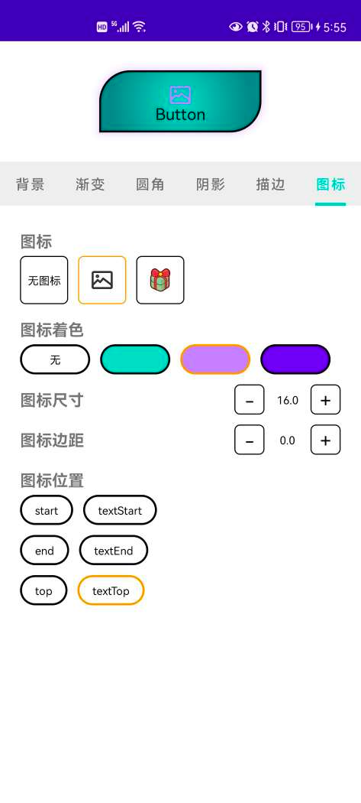

# bk

BKDrawable/BKFrameLayout/BKLinearLayout/BKTextView 可自定义 背景色/渐变/圆角/阴影/描边

- 支持 背景色[正常/选中/按下/禁用]
- 支持 渐变[类型/半径/方向/中心点XY坐标(0.0~1.0)/颜色(开始-中心-结束)]
- 支持 圆角[半径，位置]，根据宽高自动计算圆角半径 min(height,width) / 2
- 支持 阴影[颜色/半径/边距(容纳阴影的空间)]
  - 阴影颜色默认自动从背景或描边获取，也可以手动设置
  - 阴影绘制算法取自 [ShadowRenderer](https://github.com/material-components/material-components-android/blob/master/lib/java/com/google/android/material/shadow/ShadowRenderer.java)
- 支持 描边[颜色/厚度/虚线长度/虚线间隙]
- BKTextView 支持 图标[图标/尺寸/边距/着色/位置]，类似 MaterialButton 的图标




## 引入

``` groovy
repositories {
    maven { url "https://gitee.com/ezy/repo/raw/cosmo/"}
}
dependencies {
    implementation "me.reezy.cosmo:bk:0.7.0"
}
```

## BKDrawable 属性

```xml
<declare-styleable name="Background">

    <!-- 背景色(正常/选中/按下/禁用) -->
    <attr name="bkBackgroundColor" format="color" />
    <attr name="bkBackgroundColorSelected" format="color" />
    <attr name="bkBackgroundColorPressed" format="color" />
    <attr name="bkBackgroundColorDisabled" format="color" />

    <!-- 描边(颜色/厚度/虚线长度/虚线间隙) -->
    <attr name="bkStrokeColor" format="color" />
    <attr name="bkStrokeColorSelected" format="color" />
    <attr name="bkStrokeColorPressed" format="color" />
    <attr name="bkStrokeColorDisabled" format="color" />
    <attr name="bkStrokeWidth" format="dimension" />
    <attr name="bkStrokeDashWidth" format="dimension" />
    <attr name="bkStrokeDashGap" format="dimension" />

    <!-- 圆角半径 -->
    <attr name="bkCornerRadius" format="dimension">
        <!-- 根据宽高自动计算圆角半径 min(height,width) / 2-->
        <enum name="auto" value="-1" />
    </attr>
    <!-- 圆角位置 -->
    <attr name="bkCornerPosition" format="enum">
        <enum name="normal" value="0" />
        <enum name="topLeft" value="1" />
        <enum name="topRight" value="2" />
        <enum name="bottomLeft" value="3" />
        <enum name="bottomRight" value="4" />
        <enum name="sideLeft" value="5" />
        <enum name="sideRight" value="6" />
        <enum name="sideTop" value="7" />
        <enum name="sideBottom" value="8" />
        <enum name="diagonalDownward" value="9" />
        <enum name="diagonalUpward" value="10" />
    </attr>

    <!--背景渐变类型-->
    <attr name="bkGradientType" format="enum">
        <enum name="linear" value="0" />
        <enum name="radial" value="1" />
        <enum name="sweep" value="2" />
    </attr>
    <!--渐变中心点X坐标（0-1）-->
    <attr name="bkGradientCenterX" format="float" />
    <!--渐变中心点Y坐标（0-1）-->
    <attr name="bkGradientCenterY" format="float" />
    <!--渐变半径-->
    <attr name="bkGradientRadius" format="dimension" />
    <!--渐变方向-->
    <attr name="bkGradientOrientation" format="enum">
        <enum name="TOP_BOTTOM" value="0" />
        <enum name="TR_BL" value="1" />
        <enum name="RIGHT_LEFT" value="2" />
        <enum name="BR_TL" value="3" />
        <enum name="BOTTOM_TOP" value="4" />
        <enum name="BL_TR" value="5" />
        <enum name="LEFT_RIGHT" value="6" />
        <enum name="TL_BR" value="7" />
    </attr>
    <!--渐变颜色-->
    <attr name="bkGradientColors" format="string" />
    <!--渐变开始颜色-->
    <attr name="bkGradientStartColor" format="color" />
    <!--渐变中心颜色-->
    <attr name="bkGradientCenterColor" format="color" />
    <!--渐变结尾颜色-->
    <attr name="bkGradientEndColor" format="color" />


    <!-- 阴影半径 -->
    <attr name="bkShadowRadius" format="dimension" />
    <!-- 阴影颜色 -->
    <attr name="bkShadowColor" format="color" />
    <!-- 阴影边距 -->
    <attr name="bkShadowPadding" format="dimension" />
    <attr name="bkShadowPaddingLeft" format="dimension" />
    <attr name="bkShadowPaddingTop" format="dimension" />
    <attr name="bkShadowPaddingRight" format="dimension" />
    <attr name="bkShadowPaddingBottom" format="dimension" />

    <!-- 内容内边距 -->
    <attr name="bkContentPadding" format="dimension" />
    <attr name="bkContentPaddingLeft" format="dimension" />
    <attr name="bkContentPaddingTop" format="dimension" />
    <attr name="bkContentPaddingRight" format="dimension" />
    <attr name="bkContentPaddingBottom" format="dimension" />


</declare-styleable>
```


## BKTextView 图标属性

```xml
<declare-styleable name="BKTextView">

    <!-- icon -->
    <attr name="bkIcon" format="reference" />
    <attr name="bkIconSize" format="dimension" />
    <attr name="bkIconPadding" format="dimension" />
    <attr name="bkIconTint" format="color" />
    <attr name="bkIconTintMode">
        <enum name="src_over" value="3" />
        <enum name="src_in" value="5" />
        <enum name="src_atop" value="9" />
        <enum name="multiply" value="14" />
        <enum name="screen" value="15" />
        <enum name="add" value="16" />
    </attr>
    <attr name="bkIconGravity">
        <enum name="start" value="0x1" />
        <enum name="textStart" value="0x2" />
        <enum name="end" value="0x3" />
        <enum name="textEnd" value="0x4" />
        <enum name="top" value="0x10" />
        <enum name="textTop" value="0x20" />
    </attr>

</declare-styleable>
```

## LICENSE

The Component is open-sourced software licensed under the [Apache license](LICENSE).